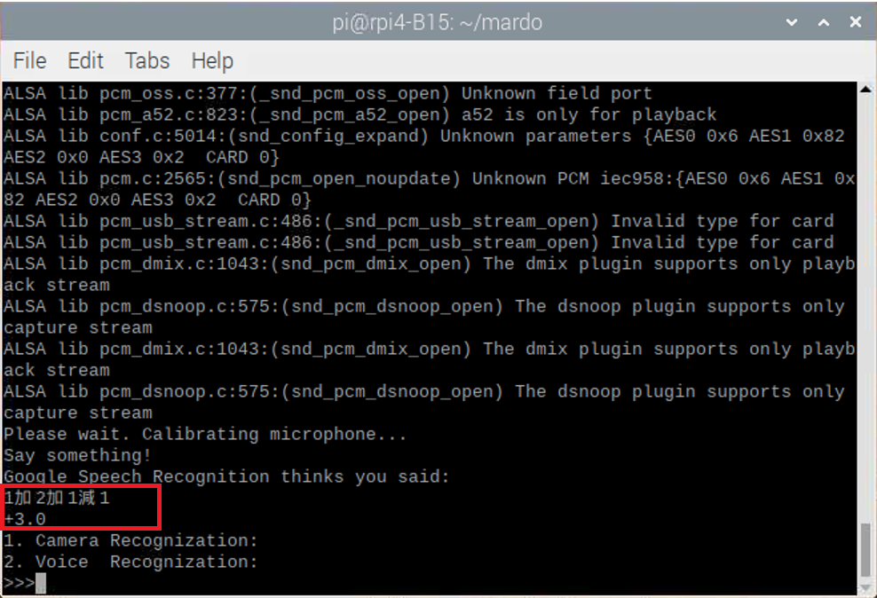

# GestureRecognition
此次專案利用Python進行軟體開發，結合Raspberry Pi以及其他硬體設備進行開發一個手勢及語音辨識的機器手臂。

## Introduction
本次開發主要有兩大主軸，我們可以分別用語音辨識以及手勢的影像辨識來讓我們自製的機器手臂能夠比出 1~5 的數字。

## Dependencies
Name  | Version   
------|-------
gTTS|2.2.3
Python|3.7.6
opencv|3.4.2
numpy|1.21.2
RPi.GPIO|0.7.0
SpeechRecognition|3.8.1

## Getting Started
### 手勢辨識
首先手勢辨識的部分，我們利用攝影機去讀取使用者的手勢，每一張手勢的圖片都會先用 `BackgroundSubtractorMOG2` 的算法來消除背景，再來分解為 **YUV 圖像**去取得 **CR 分量**，經過**高斯濾波後將圖像二值化**，之後利用 **opencv** 的 `convexHull` 尋找到手的外框並用 `convexityDefects` 取得更進一步的資訊，如 `startPoint`、`endPoint`、`farPoint`、`depth`，我們再利用這些數值進行計算，即可得到凹點個數，藉此可以判斷當下的手勢所伸出的手指共有幾隻，並且讓機械手臂比出對應的手勢及語音說出對應的數字，執行步驟如下:
1. 執行程式後輸入 **1**，選擇 `Camera Recognization`
2. 選擇 Camera 後可以顯示拍照視窗，比好手勢後，按下 `s` 進行辨識
3. 如下圖，顯示辨識結果，並且機器手臂會指出 `2` 的手勢以及產生語音
<div style="float:left;border:solid 1px 000;margin:2px;">


</div>

### 語音辨識
其次語音辨識的部分，我們能夠先說出一段數字的四則運算語音後，經由 `google_recognize` 轉成字串，經由後續的字串處理分別計算出運算結果，當結果為 5 以下的數字時，我們就讓機械手臂比出相對應的手勢，執行步驟如下:

1. 執行程式後輸入 **2**，選擇 `Voice Recognization`
2. 按下 `s` 開始入音訊
3. 如下圖，輸出計算結果，並且機器手臂會指出 `3` 的手勢
<div align="center">

</div>

### WorkFlow
#### 硬體電路示意圖
如下圖，使用元件包括**Raspberry Pi**、 **Pi Camera** 、**Respeaker**、**腳位插上擴充版**、**麵包版**、**喇叭**、數個**伺服馬達**等。
<div align="center">

</div>

#### 軟體執行流程圖
整體程式流程如下圖所示。
<div align="center">

</div>

## Results & Demo
### 手勢辨識
利用 **Raspberry Pi** 結合 **Pi Camera** 影像，進行手勢辨識，並把結果展現在機械手臂。
<div align="center">

</div>

### 語音辨識
利用 **Raspberry Pi** 結合 **Respeaker** 取得音源，進行語音辨識，並把結果展現在機械手臂。
<div align="center">

</div>

### [Demo Video完整版](https://www.youtube.com/watch?v=2ANPHodhOUU)
上方影片連結有完整的功能介紹與解說，並且成功展示語音辨識的功能。

## Usage
### 輸入執行指令:
  ``` bash
  # Execute Program
  $ python3 mardo_main.py
  ```

## References
- [Calculator Algorithm](https://www.itread01.com/content/1552121901.html)

- [OpenCV function Implement](https://blog.csdn.net/qq_36089056/article/details/85345882)

- [OpenCV ConvexHull Implement](https://kknews.cc/zh-tw/code/a68ega6.html)

- [Hand Detection and Finger Counting Using OpenCV-Python](https://medium.com/analytics-vidhya/hand-detection-and-finger-counting-using-opencv-python-5b594704eb08)

